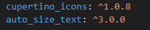
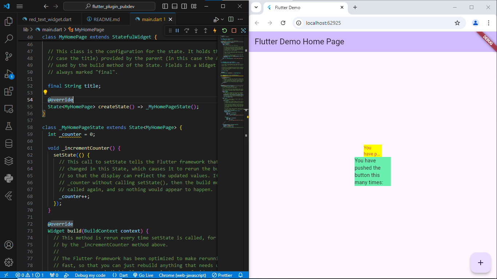

# flutter_plugin_pubdev

## Menerapkan Plugin di Project Flutter

### Langkah 1: Buat Porject Baru

### Langkah 2: Menambahkan plugin

Tambahkan plugin auto_size_text menggunakan perintah berikut di terminal

```
flutter pub add auto_size_text
```

Jika berhasil, maka akan tampil nama plugin beserta versinya di file pubspec.yaml pada bagian dependencies.

Langkah ini dilakukan untuk menambahkan plugin pada project.


### Langkah 3: Buat file red_text_widget.dart

Buat file baru bernama red_text_widget.dart di dalam folder lib lalu isi kode seperti berikut.

```
import 'package:flutter/material.dart';

class RedTextWidget extends StatelessWidget {
  const RedTextWidget({Key? key}) : super(key: key);

  @override
  Widget build(BuildContext context) {
    return Container();
  }
}
```

### Lagkah 4: Tambah Widget AutoSizeText

Masih di file red_text_widget.dart, untuk menggunakan plugin auto_size_text, ubahlah kode return Container() menjadi seperti berikut.

```
return AutoSizeText(
      text,
      style: const TextStyle(color: Colors.red, fontSize: 14),
      maxLines: 2,
      overflow: TextOverflow.ellipsis,
);
```

Setelah Anda menambahkan kode di atas, Anda akan mendapatkan info error. Mengapa demikian? Jelaskan dalam laporan praktikum Anda!

Jawab :
error, yang dikarenakan variabel text belum di definisikan pada method, dan parameter pada constructornya.

### Langkah 5: Buat Variabel text dan parameter di constructor

Tambahkan variabel text dan parameter di constructor seperti berikut.

```
final String text;

const RedTextWidget({Key? key, required this.text}) : super(key: key);
```

Langkah ini dilakukan sebagai solusi error pada langkah sebelumnya, dimana belum adannya definisi variabel text dan parameter pada constructor.

### Langkah 6: Tambahkan widget di main.dart

Buka file main.dart lalu tambahkan di dalam children: pada class \_MyHomePageState

```
Container(
   color: Colors.yellowAccent,
   width: 50,
   child: const RedTextWidget(
             text: 'You have pushed the button this many times:',
          ),
),
Container(
    color: Colors.greenAccent,
    width: 100,
    child: const Text(
           'You have pushed the button this many times:',
          ),
),
```

kedua container berguna untuk mencetak kontainer, dengan letak perbedaan pada warna dan ukuran.

Output:


Maksud parameter dari plugin auto_size_text :

a. text = untuk text
b. style = jika berisi non-null, maka style akan digunakan
c. maxLines = digunakan untuk memaksa kalimat menjadi sesuai dengan nilai parameter, misalnya jika nilai parameter diberi 2, maka text akan menjadi 2 lines/baria
d. overFlows = untuk menghandle tampilan overflow
